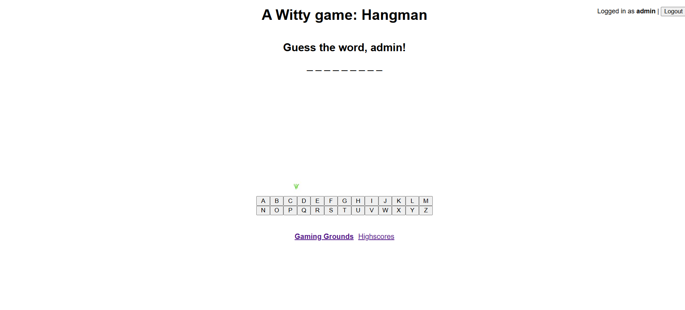
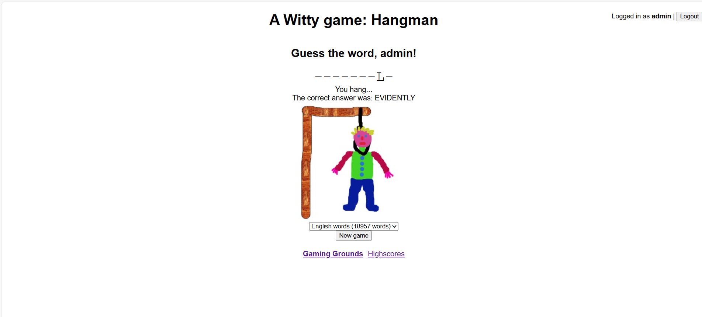

# Wt Library and C++

Have you ever discovered a library that suddenly makes you excited about your favorite language again?

Well… today I did 🙂

Today, I heard about the **Wt C++ library** — and after reading about it, I honestly felt a great joy.

Why?

Because it suddenly hit me:

> _“Wait… does this mean I can now build web applications using C++?”_

And the answer is… **yes**.

---

## One Language, Almost Everywhere

As a C++ developer, this felt like unlocking a new level.

Now, with C++, I can build:

- 🖥️ Desktop applications
- 📱 Mobile applications
- 🔌 Embedded & IoT systems
- 🌐 And finally… **Web applications**

All with a **single language**.

No switching stacks.  
No rewriting logic in JavaScript or another backend language.  
Just… C++ everywhere.

Isn’t that kind of amazing?

---

## A Simple Example: Hangman in C++

To make it even more exciting, here’s a simple example of a web game written in C++ using Wt:

**The classic Hangman game**

### Game Start

### Game End

Seeing a web game powered directly by C++ feels… refreshing.

---

## Final Thoughts

Discovering Wt made me rethink what’s possible with C++.

Maybe C++ isn’t just for systems, engines, and embedded software anymore.  
Maybe it can finally feel at home on the web too.

And that makes me wonder…

> _How many other powerful tools are still waiting to be discovered?_
