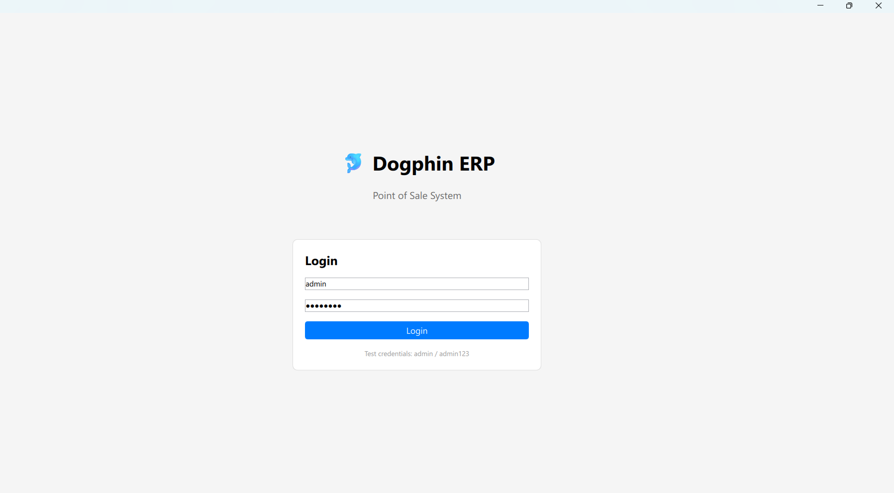
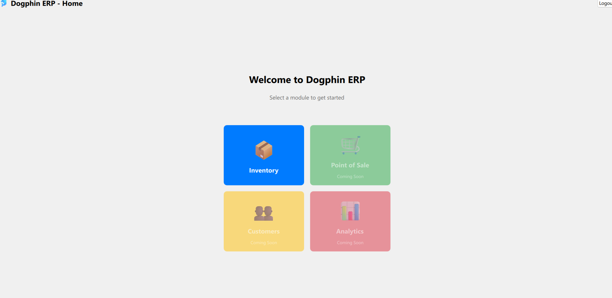
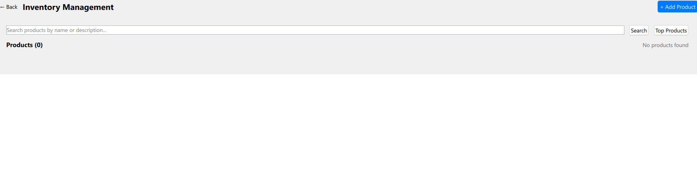

# Dogphin ERP

**A modern, high-performance Enterprise Resource Planning system for retail businesses**

Dogphin is a comprehensive point-of-sale and inventory management solution designed specifically for stores, supermarkets, and pharmacies. Built with a modern C++/Qt backend and QML frontend architecture, the system addresses common pain points in existing retail software: poor user experience, sluggish performance, limited features, and high costs.

## Key Features

- **Point-of-Sale System**: Multi-payment support (cash, card, digital wallets) with secure transaction processing
- **Inventory Management**: Real-time tracking with automated alerts for low stock levels
- **Customer Relationship Management**: Customer profiles, purchase history, loyalty programs, and feedback management
- **Marketing Tools**: Integrated promotions, advertising campaigns, and customer loyalty programs
- **QR Code Generation**: Automated product labeling with scannable codes containing product information
- **Multi-language Support**: Internationalized interface for diverse user bases
- **Modular Architecture**: Plugin-based design allowing customization for different business segments

## Technical Architecture

- **Backend**: C++ with Qt framework, utilizing gRPC for high-performance client-server communication
- **Frontend**: QML for responsive, native-feeling user interfaces
- **Microservices Design**: Separated services for authentication, inventory, analytics, customer management, marketing, and POS operations
- **Protocol Buffers**: Strongly-typed API contracts ensuring reliable communication between components

The system emphasizes speed, usability, and intelligence—reflected in its name combining "Dog" (trainable, fast, multi-talented) and "Dolphin" (swift, intelligent problem-solver). Dogphin delivers enterprise-grade functionality with an intuitive interface that reduces training time while maximizing operational efficiency.

