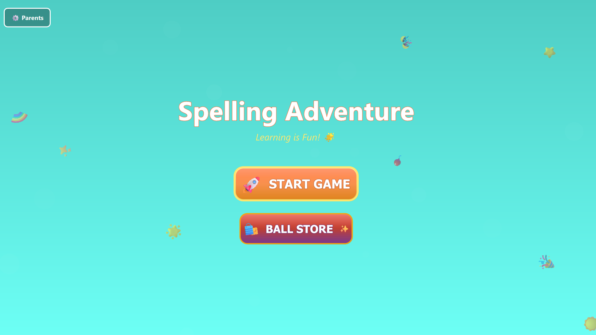
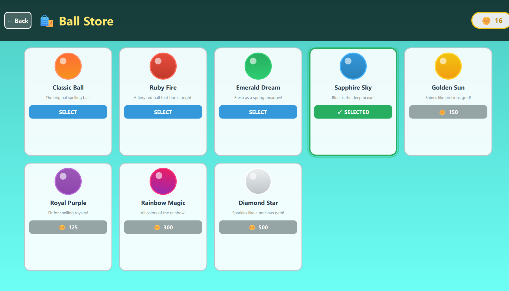
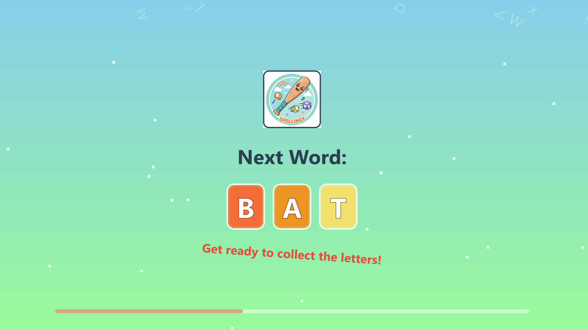
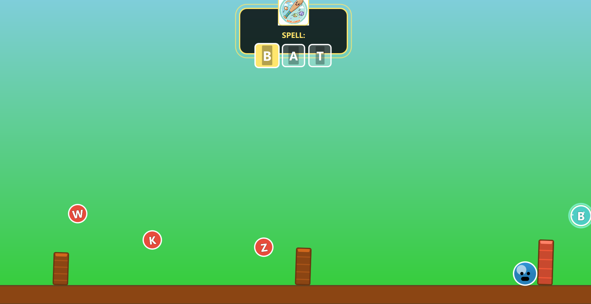
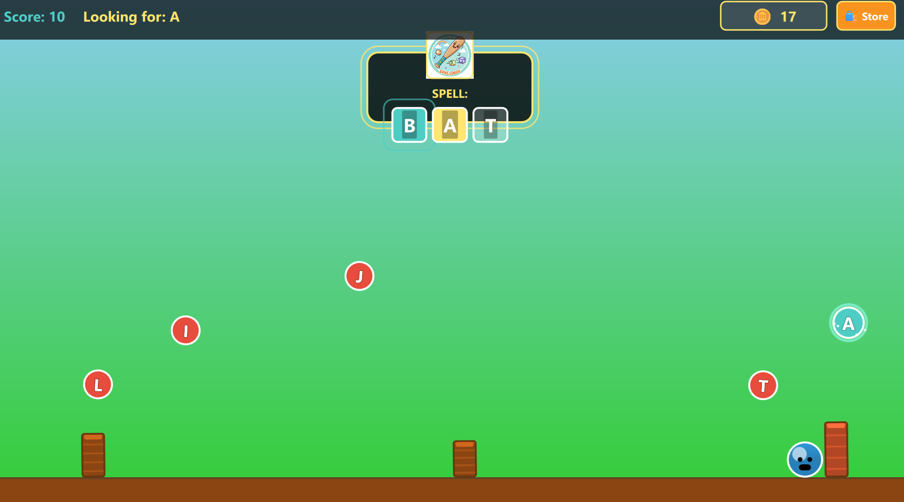

# Spelling Adventure Game

**Spellingy** is a fun and educational QML game for Windows designed for 3-year-old and older children to learn spelling through an engaging platform-style gameplay.

## Features

- **Word Learning**: Displays words clearly with text-to-speech functionality
- **Interactive Gameplay**: Ball-jumping mechanics with letter collection
- **Visual Appeal**: Colorful, child-friendly graphics and animations
- **Audio Feedback**: Success and error sound effects
- **Progressive Difficulty**: Multiple words to spell in sequence
- **Touch Controls**: Simple tap-to-jump mechanics perfect for children

