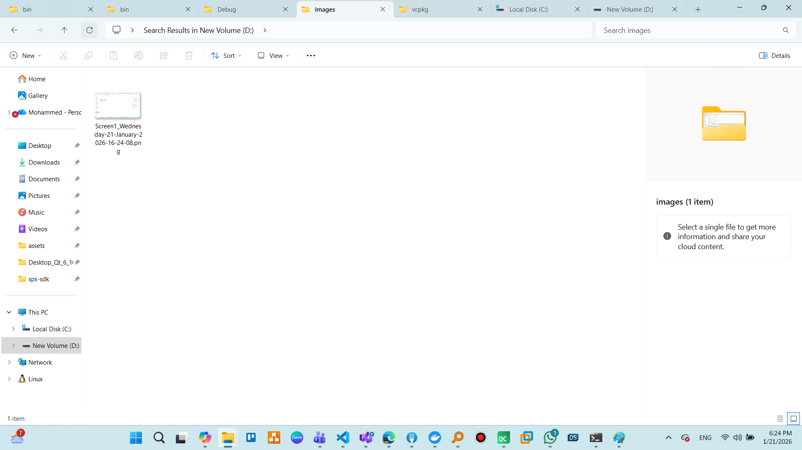
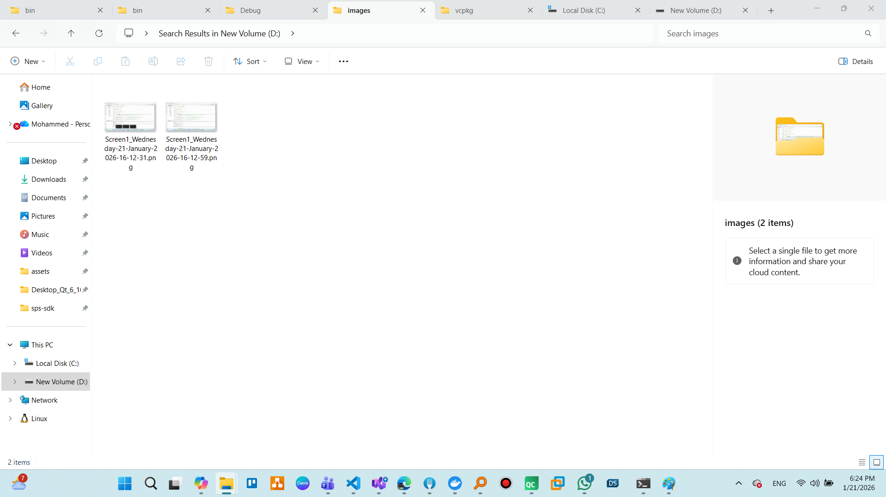
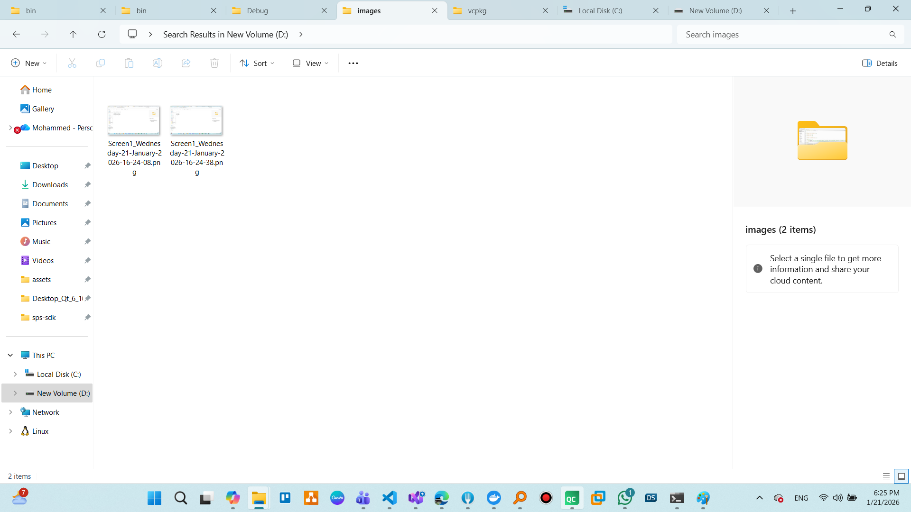
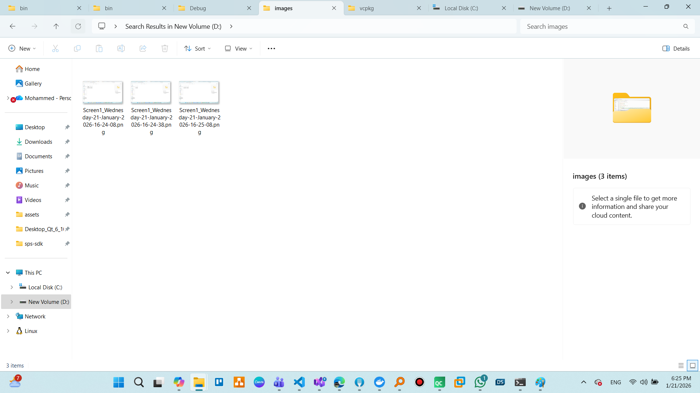
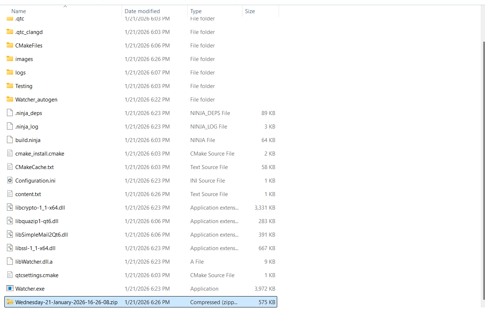
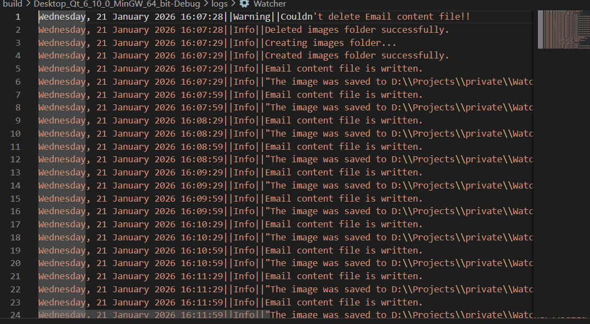

# Watcher

Windows application to take screen shots and email them on time.

## Overview

This application captures screenshots at regular intervals and emails them as compressed archives. It's useful for monitoring activity on a Windows system.

## Features

- Automatic screen capture at configurable intervals
- Captures all connected monitors
- Tracks active window titles
- Compresses captured images into ZIP archives
- Emails archives at configurable intervals
- Comprehensive logging system

